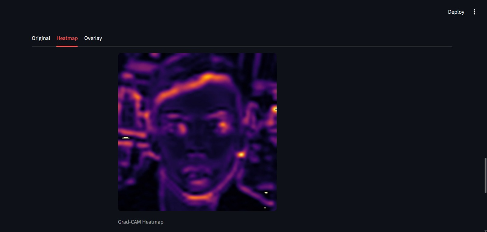
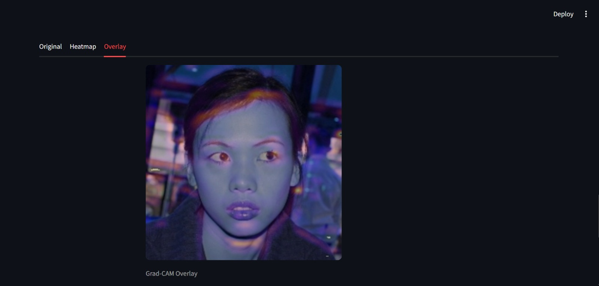

# 🛡️ DeepShield AI

### Explainable Deepfake Detection System using CNN, Grad-CAM, and Streamlit

DeepShield AI is an end-to-end Explainable AI (XAI) platform that detects AI-generated facial images and provides visual explanations for every prediction. The system combines Deep Learning, Computer Vision, and Explainable AI techniques to help users understand not only *what* the model predicts, but also *why* it makes that prediction.

---

## 📌 Problem Statement

The rapid growth of Generative AI technologies has enabled the creation of highly realistic synthetic faces, commonly known as **Deepfakes**. These manipulated images pose significant challenges in areas such as:

- Identity Fraud
- Social Media Misinformation
- Digital Trust & Authenticity
- Cybersecurity Threats
- Media Manipulation

Most deepfake detection systems only provide a prediction result without explaining the reasoning behind the decision. This lack of transparency reduces trust and makes model outputs difficult to interpret.

**DeepShield AI addresses this problem by combining Deepfake Detection with Explainable AI (XAI), allowing users to visualize the regions of an image that influenced the model's decision.**

---

## 🎯 Project Objectives

- Detect AI-generated facial images.
- Classify images as **Real** or **Fake**.
- Generate confidence scores.
- Provide Grad-CAM visual explanations.
- Improve model transparency through Explainable AI.
- Generate downloadable PDF reports.
- Deliver an intuitive user experience through Streamlit.

---

## 🚀 Features

### 🔍 Deepfake Detection
Detects whether an uploaded facial image is Real or AI Generated.

### 📊 Confidence Analysis
Displays model confidence score for each prediction.

### 🔥 Grad-CAM Explainability
Highlights image regions influencing the CNN prediction.

### 🧠 AI Reasoning
Provides human-readable reasoning based on visual evidence.

### 📄 Automated PDF Reports
Generates downloadable reports containing:
- Prediction
- Confidence Score
- Heatmap
- Overlay Visualization
- AI Explanation

### 🎨 Interactive Streamlit Dashboard
Modern UI designed for easy image analysis and report generation.

---

## 🏗️ System Architecture

```text
Input Image
      │
      ▼
CNN Model Prediction
      │
      ▼
Real / Fake Classification
      │
      ▼
Confidence Score
      │
      ▼
Grad-CAM Heatmap
      │
      ▼
AI Reasoning Engine
      │
      ▼
PDF Report Generation
```

---

## 🛠️ Technologies Used

| Category | Technologies |
|-----------|-------------|
| Programming Language | Python |
| Deep Learning | TensorFlow, Keras |
| Computer Vision | OpenCV |
| Explainable AI | Grad-CAM |
| Data Processing | NumPy, Pillow |
| Frontend | Streamlit |
| Reporting | ReportLab |
| Visualization | Matplotlib |

---

## 📂 Project Structure

```text
DeepShield_AI/
│
├── app.py
├── DeepShield.ipynb
├── check_model.py
├── test.py
├── test_gradcam.py
├── requirements.txt
│
├── assets/
│   ├── Landing Page.jpeg
│   ├── Original image.jpeg
│   ├── Uploaded image before analysis.jpeg
│   ├── Uploaded image after analysis.jpeg
│   ├── Prediction Result.jpeg
│   ├── Heatmap.jpeg
│   ├── Overlay.jpeg
│   ├── AI Reasoning.jpeg
│   ├── Export Report.jpeg
│   ├── logo_horizontal.png
│   └── watermark.png
│
├── css/
├── utils/
└── Sample Test images/
```

---

## 📊 Model Overview

The system uses a Convolutional Neural Network (CNN) trained to distinguish between real and AI-generated facial images.

### Model Workflow

1. Image Upload
2. Image Preprocessing
3. CNN Inference
4. Confidence Calculation
5. Grad-CAM Visualization
6. AI Reasoning Generation
7. PDF Report Export

---

# 📸 Application Screenshots

## Landing Page


---

## Uploaded Image Before Analysis


---

## Uploaded Image After Analysis


---

## Prediction Result


---

## Grad-CAM Original Uploaded Image


---

## Grad-CAM Heatmap



---

## Heatmap Overlay



---

## AI Reasoning


---

## 📄 Explainable AI (XAI)

DeepShield AI integrates Grad-CAM (Gradient-weighted Class Activation Mapping) to visualize which regions of a face influenced the model's decision.

Benefits:

- Improves transparency
- Increases trust in predictions
- Helps identify suspicious facial regions
- Supports explainable decision making

---

## 📈 Output Generated

For every uploaded image, the system provides:

- Prediction Label
- Confidence Score
- Heatmap Visualization
- Overlay Visualization
- AI Reasoning
- Downloadable PDF Report

---
## Exportable PDF Report


---

## ⚙️ Installation

Clone the repository:

```bash
git clone https://github.com/Divya-Kathare/DeepShield-AI.git
```

Navigate to project directory:

```bash
cd DeepShield-AI
```

Install dependencies:

```bash
pip install -r requirements.txt
```

Run Streamlit:

```bash
streamlit run app.py
```

---

## 📈 Future Enhancements

- Real-time Webcam Deepfake Detection
- Video Deepfake Detection
- Multi-Class Deepfake Classification
- Cloud Deployment
- REST API Integration
- Advanced Explainability Dashboard

---

## 👩‍💻 Author

### Divya Kathare

**LinkedIn:**  
https://www.linkedin.com/in/divya-kathare-41323a3a0/

**GitHub:**  
https://github.com/Divya-Kathare

---

## ⭐ If you found this project useful, please consider giving it a star.
